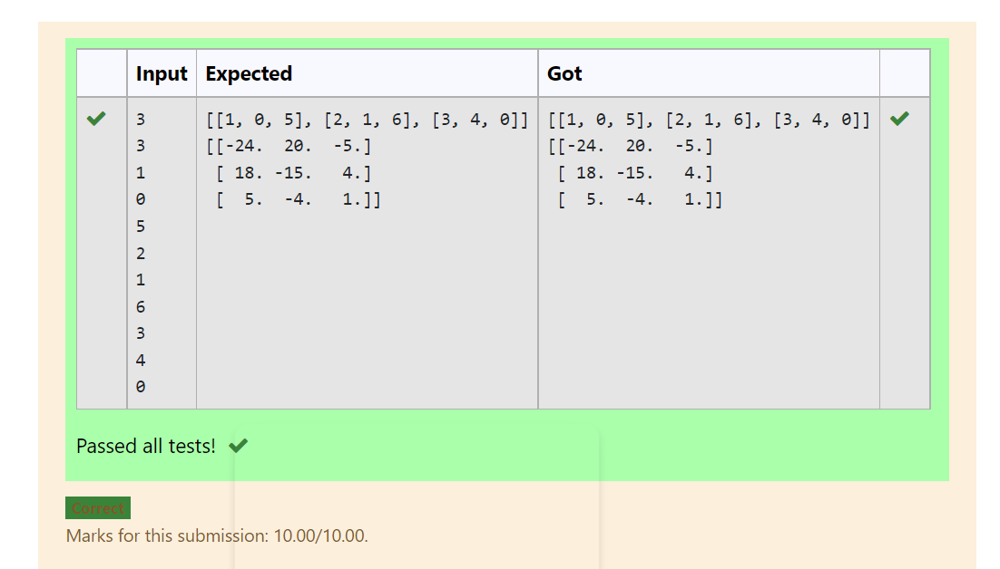

# Inverse-of-matrix

## AIM:To find the invese of a given matrix.

## ALGORITHM:
### Step 1:
Import numpy module.
### Step 2:
Declare a variables l1 and l2 as an empty list.
### Step 3:
Get the input of the variables m and n.
### Step 4:
Loop a variable i in the range of n and nest loop a variable j in the range m.
### Step 5:
get the value of num variable.
### Step 6:
During the loop append the num values to l1 and l1 values to list 12
### Step 7:
Declare a variable value l to l2 by coverting to an array.
### Step 8:
Declare a variable inverse,using numpy module's linalg and inv functions find the inverse of l2.
### Step 9:
Print the value of the inverse.

## PROGRAM:
import numpy as np
l1,l2=[],[]
n1,n2=int(input()),int(input())
for i in range (n1):
    for j in range (n2):
       values=int(input())
       l1.append(values)
    l2.append(l1)
    l1=[]
print(l2)
matrix=np.array(l2)
inverse=np.linalg.inv(matrix)
print(inverse)

## OUTPUT:

## RESULT:
Thus the program is written to find the inverse of the matrix.
